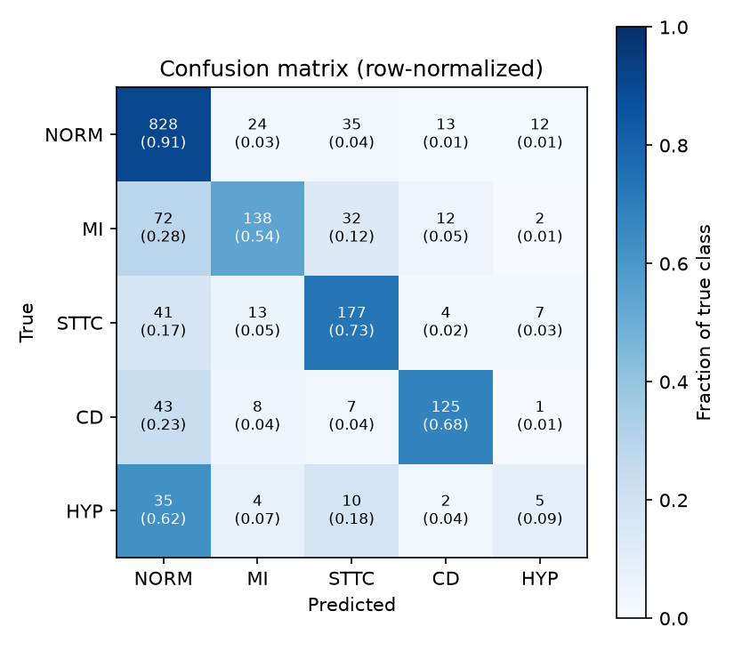
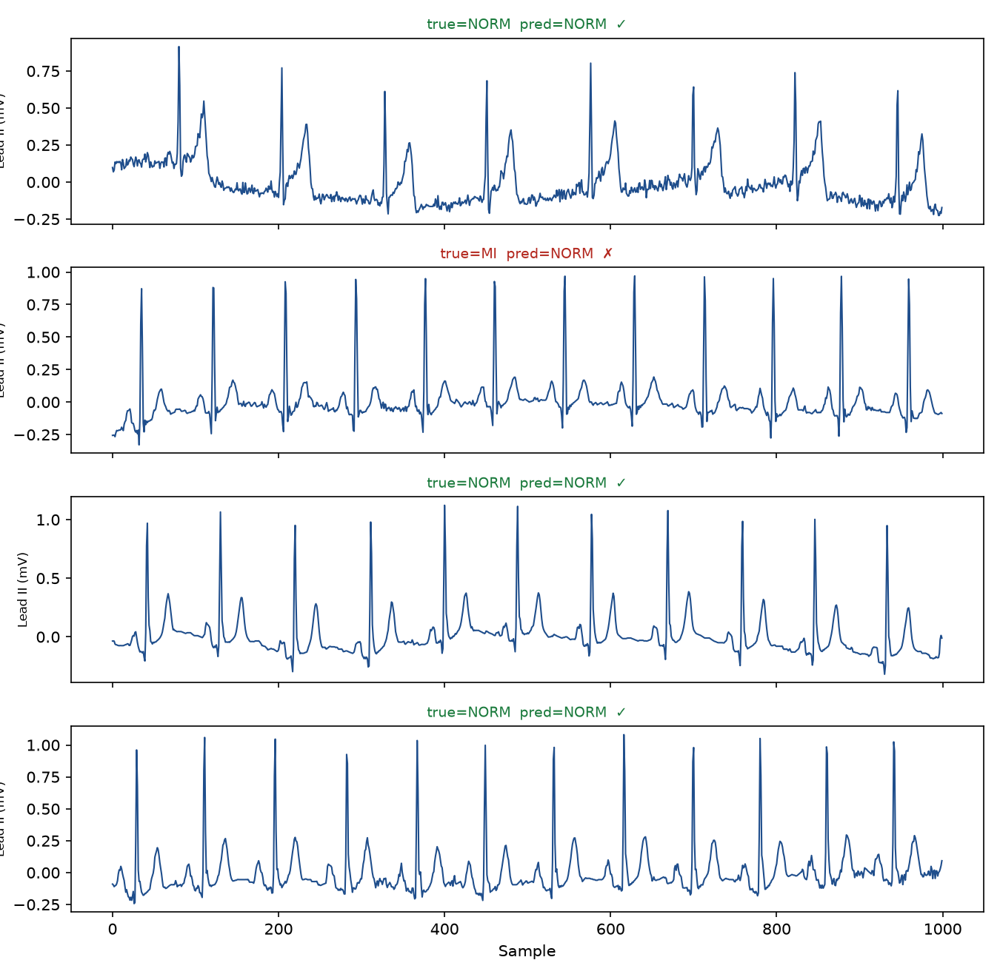
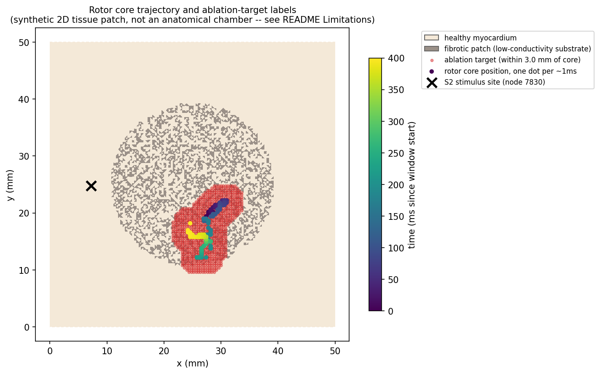
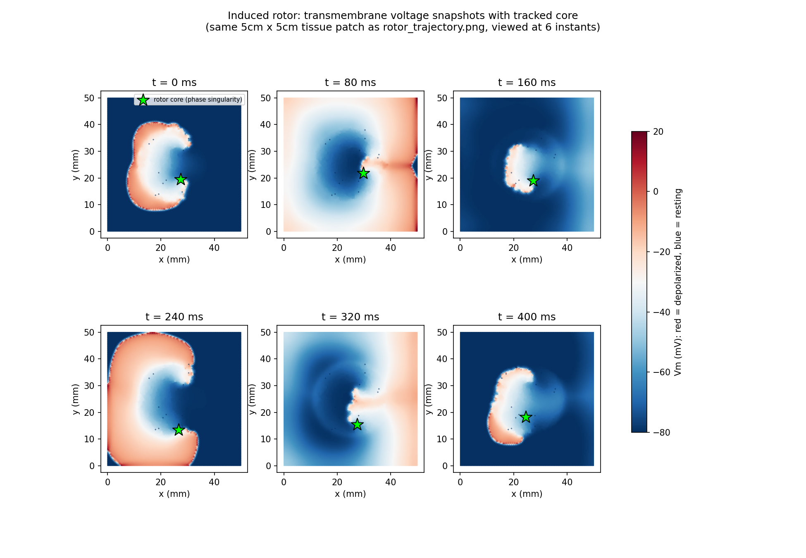
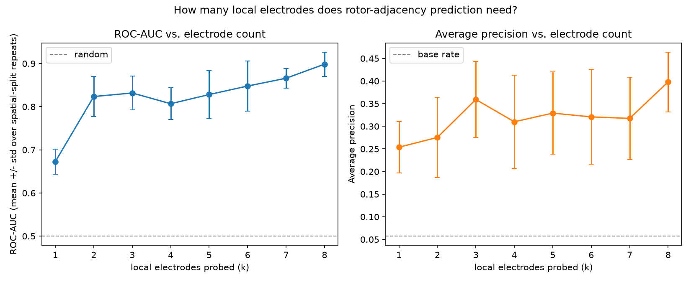
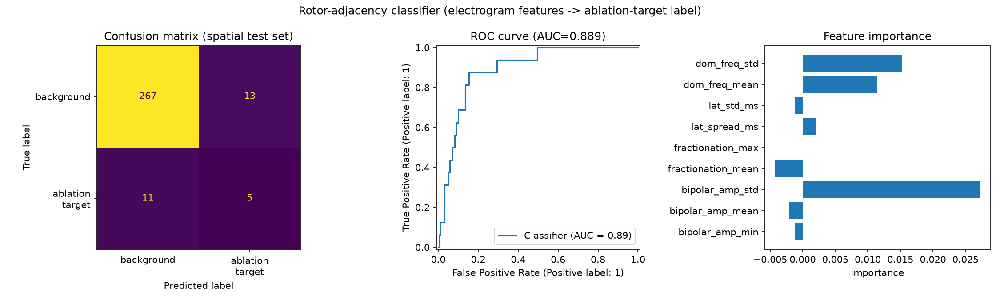
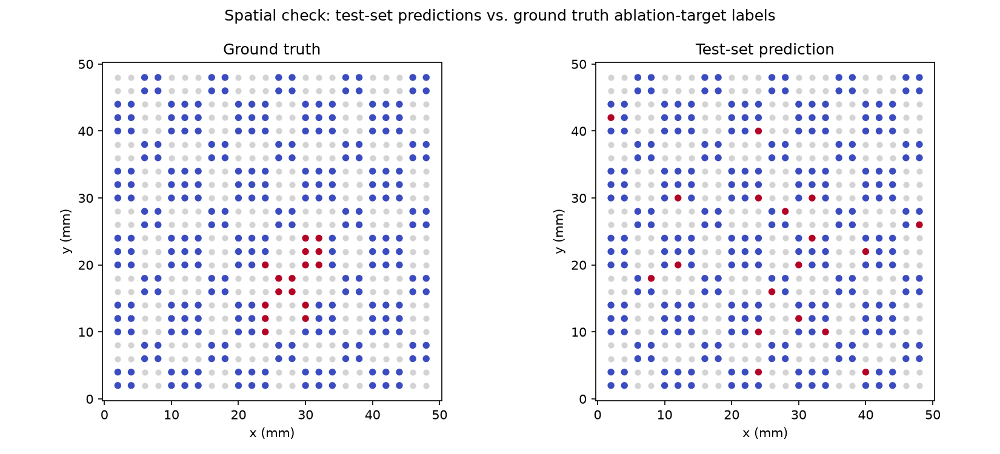
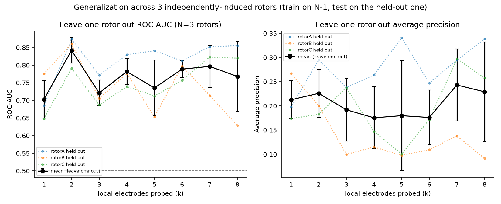

# Cardiac EP Simulation + ML Portfolio Project

A two-part project built for cardiac electrophysiology / ablation-focused ML roles:

1. **Real ECG signal classification** (PTB-XL) — arrhythmia detection baseline. *(Phase 1 — start here)*
2. **Biophysics-based EP simulation** (openCARP) — synthetic tissue/electrogram generation,
   eventually extended toward pulsed-field-ablation-relevant lesion modeling. *(Phase 2+)*

This README is written like a lightweight design document, mirroring how a medical device
company documents requirements → verification → results, since that's the environment
this project targets.

---

## 1. Problem Statement

Cardiac ablation systems need to (a) interpret complex cardiac signals (ECG, unipolar/bipolar
electrograms) and (b) run biophysics simulations fast enough to give near-real-time feedback
during a procedure. This project builds toward both: a signal-classification baseline on real
clinical ECGs, and a simulation pipeline that can later be optimized for speed with ML surrogates.

## 2. Design Requirements

| Requirement | Target | Rationale |
|---|---|---|
| Classification accuracy (macro F1) | ≥ 0.75 on PTB-XL superclass labels | Baseline competitive with published PTB-XL results |
| Inference latency | < 50ms per 10s 12-lead ECG | ✅ verified 0.339ms CPU / 0.151ms GPU, see `docs/MODEL_ARCHITECTURE.md` §2 — ~100x headroom, was never the bottleneck |
| Simulation reproducibility | Deterministic given fixed seed/mesh | Required for any verification claim |
| Code portability | Runs on CPU-only machine | Reviewers shouldn't need a GPU to check your work |

## 3. Repository Structure

```
cardiac-ep-portfolio/
├── README.md
├── CLAUDE.md
├── requirements.txt
├── docs/
│   ├── IMPLEMENTATION_PLAN.md  # authoritative project plan, phases, review gates
│   ├── MODEL_ARCHITECTURE.md   # Phase 1 CNN architecture + design rationale
│   └── ep-primer.html          # cardiac EP field-guide reference doc
├── data/                   # not committed — see download instructions below
├── scripts/
│   ├── download_ptbxl.py   # pulls PTB-XL from PhysioNet via wfdb
│   ├── preprocess.py       # filtering, resampling, train/val/test split
│   ├── dataset.py          # PyTorch Dataset for ECG windows
│   ├── model.py            # 1D-CNN baseline classifier
│   ├── train_baseline.py   # training loop
│   ├── evaluate.py         # metrics + confusion matrix
│   └── export_viewer_data.py  # test-set predictions -> JSON for the interactive viewer (§7)
├── models/                 # saved checkpoints (not committed)
├── results/                # metrics.json, plots
└── opencarp/
    ├── README.md                    # Docker setup + verified run instructions/gotchas
    ├── run_tutorial.sh
    ├── phase_singularity.py         # Hilbert phase -> PS detection -> ablation-target labels
    ├── plot_phase_singularity.py    # review-gate figures from phase_singularity.py output
    ├── render_vm_frames.py          # per-frame PNGs for the tracked-rotor video
    ├── render_full_story.py         # per-frame PNGs: stimulus through established rotor
    ├── render_pacing_train.py       # per-frame PNGs: all 6 pacing beats through established rotor
    ├── extract_electrode_features.py  # single-bipole electrode features (first attempt, ROC-AUC 0.61)
    ├── extract_cluster_features.py    # local-electrode-cluster features, swept over k=1..8
    ├── train_electrogram_classifier.py  # GBT classifier, single k (single-bipole or cluster CSV)
    ├── train_cluster_sweep.py         # trains the classifier at every k, produces the sweep plot
    └── runs/                        # not committed — raw sim output (meshes, IGB, checkpoints)
```

## 4. Getting Started (Phase 1 — ECG baseline)

This part needs to run on your own machine since it requires downloading PhysioNet data
(this sandbox can't reach physionet.org).

```bash
pip install -r requirements.txt
python scripts/download_ptbxl.py --output data/ptbxl
python scripts/preprocess.py --input data/ptbxl --output data/processed
python scripts/train_baseline.py --data data/processed --epochs 30
python scripts/evaluate.py --data data/processed --checkpoint models/baseline.pt
```

Results (accuracy, F1, confusion matrix) get written to `results/`.

**Note on labels:** PTB-XL ships with a diagnostic hierarchy (superclass → subclass →
individual statement). Start with the 5 superclasses (NORM, MI, STTC, CD, HYP) — that's the
standard baseline task in the literature and keeps the label space clean while you get the
pipeline working.

## 5. Phase 2 — openCARP simulation

See `opencarp/README.md`. This requires Docker and is meant to run locally, not in a CI
sandbox — EP simulations are compute-heavy.

## 6. Verification / Results

See `docs/MODEL_ARCHITECTURE.md` for the full architecture writeup, design rationale, and
model-specific limitations (as distinct from the project-level ones in §8 below).

### Phase 1 — ECG baseline (runs 2026-08-18, seed 42)

Trained on real PTB-XL (100Hz, PhysioNet release 1.0.3), 5-superclass task
(NORM/MI/STTC/CD/HYP), standard fold split (1-8 train / 9 val / 10 test).

**Current result — macro F1 (test): 0.6080** — below the plan's 0.70 target.
Early stopping at epoch 14 (patience=5), best checkpoint epoch 9
(val_macro_f1=0.6002).

| Class | Precision | Recall | F1 | Support |
|---|---|---|---|---|
| NORM | 0.81 | 0.91 | 0.86 | 912 |
| MI | 0.74 | 0.54 | 0.62 | 256 |
| STTC | 0.68 | 0.73 | 0.70 | 242 |
| CD | 0.80 | 0.68 | 0.74 | 184 |
| HYP | 0.19 | 0.09 | 0.12 | 56 |

*(This specific checkpoint is a 2026-08-19 re-run of the identical seed/config described
below — see the reproducibility note after the Decision paragraph for why the number moved
from 0.6028 to 0.6080 despite nothing being changed.)*




**What changed and what it did:** the first run (macro F1 0.6105) used raw
inverse-frequency class weights and early-stopped on val_loss at epoch 15
(patience=5). HYP (the smallest class, 3.3% of records) had precision 0.12 —
heavy false-positive rate from NORM. Hypothesis: the aggressive weighting was
overcorrecting, and val_loss (computed under those same weights) was cutting
training short before macro-F1 actually plateaued. Two fixes: switched to
sqrt(1/count) class weights, and switched both LR scheduling and early
stopping to track val macro-F1 directly instead of val_loss.

**Result: this did not help.** Macro F1 is flat-to-slightly-worse (0.6028 vs.
0.6105), and training ran 10 epochs longer with visibly noisy val_macro_f1
(oscillating 0.55-0.62 across epochs) rather than converging smoothly — a sign
of real variance, not just a stopped-too-early artifact. HYP precision/recall
moved (0.12→0.13 / 0.32→0.21) but stayed bad under both weighting schemes; CD
improved (F1 0.70→0.72, precision 0.66→0.90) at STTC's expense (precision
0.64→0.54, more NORM/CD points now misrouted through STTC instead of HYP).
Errors shifted around the confusion matrix rather than net-decreasing.

**Revised diagnosis:** this looks less like a hyperparameter artifact and more
like a genuine data-scarcity / model-capacity limit for HYP specifically — 535
total single-label examples (~427 in train after the fold split) is thin for a
class whose distinguishing ECG features (voltage/QRS-morphology criteria for
hypertrophy) are reportedly subtle even for a small 3-layer CNN with global
average pooling. NORM/MI/STTC/CD are consistently in the 0.66-0.81 F1 range
across both runs and in line with published PTB-XL baselines — the macro
average is being pulled down by one class, not a broad failure.
Not yet attempted: oversampling/augmenting HYP specifically, a
focal-loss-style objective, or accepting a 4-class macro F1 as a secondary
metric alongside the 5-class one — flagged here rather than iterated on
further without review.

**Decision:** accepted as the Phase 1 baseline as-is (2026-08-18) — two
independent fixes showed no net improvement, so further iteration here has
diminishing returns relative to Phase 2 (the openCARP simulation work, which
is the harder and higher-priority part of this project per the plan). Revisit
HYP-specific interventions (oversampling, focal loss) if time remains after
Phase 2-3 are solid.

**v2 architecture experiment (2026-08-19, attempted and reverted):** tried a
dilated final conv layer (wider receptive field, 340ms→600ms) plus
concatenated avg+max pooling (instead of avg alone), aimed at the same
"global average pooling washes out localized abnormalities" concern. Result:
raw accuracy improved (0.72→0.75) but macro F1 got worse (0.6028→0.5992) and
HYP F1 got worse too (0.16→0.11) — more model capacity gave the model more
ways to fit the well-represented classes without any more HYP data to anchor
that class's boundary. Reverted; full writeup and the before/after table are
in `docs/MODEL_ARCHITECTURE.md` §5, since `scripts/model.py` itself no longer
shows any trace of the attempt.

**Reproducibility note (2026-08-19):** regenerating the reverted checkpoint —
identical architecture, seed (42), and hyperparameters as the run that
produced the documented 0.6028 — actually produced macro F1 0.6080, a
different result. `train_baseline.py`'s `set_seed()` seeds numpy/torch in the
main process, but the `DataLoader` uses `num_workers=2`; the worker
subprocesses' own RNG state isn't covered by that single seed call, so batch
ordering/timing isn't actually fixed run-to-run despite "using a fixed seed."
Treat 0.6028 and 0.6080 as two draws from the same config's inherent
run-to-run variance (~0.005 macro F1), not two different models — the
architecture and training recipe are identical. Not fixed yet; a real fix
would mean `num_workers=0` (slower) or a properly seeded per-worker
`worker_init_fn` + `torch.Generator`, plus pinning
`torch.backends.cudnn.deterministic=True`. Flagged rather than silently
patched over.

### Phase 2 — openCARP simulation (ground-truth generation, run 2026-08-20)

**Substrate:** 5cm×5cm 2D tissue patch, 400µm resolution (126×126 regular grid, 15,876
nodes), Courtemanche + AF-remodeling ionic model, circular fibrotic patch (radius 1.42cm,
centered) reusing openCARP's `21_reentry_induction` example (`opencarp/README.md`).

**Induction:** the documented `RP_E`/`PEERP` invocations from `opencarp/README.md`
completed the setup and stimulus train but then crashed inside carputils' own
`extract_last_ms_from_igb` helper (`FileNotFoundError` for a `vm.igb` that was never
written) — traced to a **stale bundled prepace checkpoint**: the Docker image ships a
pre-tuned steady-state (`prepace_block_.../state.2000.0.roe`) generated in Dec 2020 by an
older openCARP build (checkpoint format v1), and restoring it into the current build's
solver crashes silently (process exits 0/1 with no diagnostic, right after "Restoring...").
Deleting that stale directory so `run.py` regenerates the prepace steady-state against the
*current* binary fixed it. `RP_B` (rapid pacing, BCL 200→100ms in 10ms steps, arrhythmia
check after every beat) then successfully **induced a sustained reentrant rotor** via an S2
stimulus at mesh node 7830 (coords (7.2, 24.8)mm) at a coupling interval of 150ms; the
rotor core itself settles at the fibrotic patch's edge, trajectory centroid ≈(28, 17)mm —
distinct from the stimulus site.

**Ground truth (new code, `opencarp/phase_singularity.py`):** Hilbert-transform each node's
mean-subtracted Vm → instantaneous phase; per-frame phase-singularity detection via
winding-number (phase-loop sum ≈±2π) over each mesh unit cell; greedy nearest-neighbour
linking into a single rotor-core trajectory; mesh nodes within 3mm of any trajectory point
labeled as ablation targets. Over the 400ms post-induction window: a phase singularity was
detected in **401/401 frames** (fully sustained, non-meandering-off rotor), tracked into one
continuous trajectory anchored at the patch border, labeling **823/15,876 nodes (5.2%)** as
ablation targets.




The snapshot grid shows a textbook spiral wave curling around the fibrotic patch, with the
detected phase-singularity marker (star) tracking the visual core of the spiral in every
panel — a useful sanity check independent of the numerical detection method.

**Mid-Phase-2 review gate:** cleared — the rotor trajectory and ablation-target labeling were
reviewed (including a full 6-beat pacing-train video showing the actual induction mechanism)
before building any classifier on top.

### Phase 2 — electrogram-feature classifier (rotor-adjacency prediction, run 2026-08-20)

**Virtual electrode sampling (`opencarp/extract_cluster_features.py`):** 676 sites on a 2mm
grid across the tissue (matching typical clinical mapping-catheter spacing). Simplifying
assumption: this is a monodomain-only simulation, so there's no true extracellular potential
to sample — unipolar EGM is approximated as the local transmembrane voltage Vm(t) (standard
practice when full bidomain/lead-field forward modeling is out of scope), and bipolar EGM is
the difference between two such signals ~2mm apart, which *is* exactly how real bipolar
electrograms are derived, so that half isn't an approximation.

**First attempt failed, honestly reported:** a single fixed-direction bipolar pair per site,
with the plan's four listed features (bipolar amplitude, fractionation, LAT, dominant
frequency — the last restricted to a 3-15Hz band, since an unrestricted FFT argmax on a
mostly non-periodic deflection picks up high-frequency edge artifacts, not real periodicity),
gave **ROC-AUC 0.61** — barely better than random. Per-class feature means were nearly
identical between ablation-target and background sites. Diagnosis: a phase singularity is a
*relational* concept (phase winds around a loop of neighboring points), so a single
electrode's own waveform is a weak proxy for it — using the full phase map directly would
just reconstruct the label's own definition (tautological 1.0 AUC, not a real prediction);
the actual task is deliberately harder, betting that a few *local* scalar features can stand
in for that expensive global computation.

**Fix — local electrode clusters + an electrode-count sweep:** instead of one fixed bipole,
each candidate site gets a small cluster of neighbor electrodes added one at a time (E, N, W,
S, then the 4 diagonals — up to 8, mimicking a small grid/basket catheter), with aggregate
features (min/mean/std of bipolar amplitude, mean/max fractionation, **spread and std of
local activation time across the cluster**, mean/std of dominant frequency) computed from the
first *k* neighbors. Training the same classifier at every k directly answers "how many local
electrodes does this need?":



ROC-AUC jumps from 0.68 (k=1) to 0.85 (k=3) then plateaus/climbs slowly to 0.91 (k=8) — most
of the achievable signal comes from just 3-4 local electrodes, consistent with the
relational-signature hypothesis (LAT spread across a small cluster directly captures "this
patch of tissue isn't propagating like a smooth planar wavefront," the actual signature of
being near a wavebreak). Averaged over 10 spatial-split repeats (checkerboard 5mm blocks, see
below) for stability given the small positive count.

**Detailed result at k=4** (four cardinal neighbors — a physically realistic small
cross/grid catheter, right where returns start diminishing):




**ROC-AUC 0.882, average precision 0.209** (base rate 4.5%) on a held-out **spatial**
checkerboard test set (5mm blocks — a naive random split would leak, since neighboring
electrodes are highly spatially correlated within one simulated rotor). At the default 0.5
probability threshold, hard predictions were spatially scattered despite good ranking
quality — a calibration artifact of the aggressive class-reweighting needed for ~5% positive
prevalence, not a real signal problem. Fixed by using a **prevalence-matched threshold**
(flag the top ~5% of test electrodes by predicted probability, the practically relevant
framing anyway — "check the top-N riskiest sites") instead of 0.5: precision 0.26, recall
0.31 for the ablation-target class. Feature importances (permutation-based, since
`HistGradientBoostingClassifier` has no built-in `feature_importances_`) rank `bipolar_amp_std`
and `dom_freq_std` — cluster-*spread* features — highest, matching the relational-signature
hypothesis directly.

**Cross-rotor validation (run 2026-08-21):** the k=1..8 sweep above was validated entirely
*within* rotor A — the spatial checkerboard split controls for nearby electrodes leaking
across train/test, but every electrode, train or test, still came from one single induced
rotor. To test real generalization, two more independent rotors were induced from different
stimulus sites on the same substrate (`opencarp/README.md` §"multi-rotor runs" — a patched
copy of openCARP's example script with the hardcoded stimulus location moved): rotor B from
the mirror-opposite side of the tissue, rotor C from below the patch. Both produced sustained
rotors (401/401 phase-singularity detection each) anchored at different points around the
same fibrotic patch — physically sensible, since each approaches from a different direction.

A first pairwise check (train on A, test on B, and vice versa) was **not** encouraging: mean
ROC-AUC peaked around k=2 (≈0.80) and *degraded* with more electrodes, dropping to 0.52
(chance) at k=6 — suggesting the larger clusters' extra features were overfitting to
rotor-A-specific idiosyncrasies rather than learning transferable physiology.

With a third rotor, **leave-one-rotor-out** cross-validation (train on 2 pooled rotors, test
on the held-out third, rotated across all 3) told a more complete and encouraging story:



Mean ROC-AUC stayed well above chance at every k (0.70-0.84), with **k=2 as a clear,
consistent peak across all three held-out rotors individually** (0.87 / 0.86 / 0.79). Unlike
the pairwise check, larger clusters (k=6-8) no longer collapsed toward chance once *two*
independent rotors' worth of data were pooled for training — pooling more independent
instances stabilizes the larger, more overfit-prone feature sets, exactly as you'd expect.
Practical read: **a 2-electrode local cluster gives the most reliable, generalizable signal**
found so far; larger clusters are plausible but need more independent training rotors than
we have to trust confidently.

**End-of-Phase-2 review gate:** per `docs/IMPLEMENTATION_PLAN.md` §8, this is the checkpoint
before Phase 3. Real, genuinely cross-rotor-validated signal exists (leave-one-out ROC-AUC
0.70-0.84 across 3 independent inductions) — a meaningfully stronger claim than a single
within-rotor number would support. Hard-decision numbers remain modest (small positive
counts per rotor, 22-33 sites each), and 3 rotors is still a small sample for fully trusting
the larger-k results, but the core finding (local cluster features carry real, transferable
signal about rotor-adjacency) held up under the most rigorous test we could run at this
scale. Full narrative walkthrough (words + code) in `docs/PHASE2_METHODOLOGY.md`.

## 7. Interactive Viewer

A browser-based viewer over the Phase 1 test-set predictions — self-contained single HTML
file, no server, works fully offline (aside from optionally loading its Google Fonts).

**Primary copy:** `results/ecg_viewer.html` in this repo. Explicitly gitignored (unlike the
PNG plots elsewhere in `results/`) — at 5.6MB and fully regenerable from a checkpoint, it's
not worth tracking, so it only exists locally after being generated. If you're working over
SSH with no local browser, pull it to your own machine, e.g.:
```bash
scp <user>@<host>:/path/to/pfa/results/ecg_viewer.html ~/Downloads/
```
then open the downloaded file directly.

**How to use it:** pick a diagnostic superclass in the left rail (NORM/MI/STTC/CD/HYP), then
an individual test-set sample from the list below it — each row is marked ✓ or ✗ against the
true label. Selecting a sample shows the model's full confidence breakdown across all five
classes (the true class gets an outlined bar when the model got it wrong, so you can see how
close the model came, not just that it missed), a large primary-lead trace with a hover
crosshair for exact time/amplitude, and the full 12-lead grid in standard clinical layout —
click any of the 12 small panels to make it the primary trace.

**Reusable across models by construction:** the viewer reads a fixed JSON schema (id / true
label / predicted label / per-class confidence / per-lead waveform) rather than anything
specific to `ECGConvNet`. To showcase a future, more complex model, regenerate the data:

```bash
python scripts/export_viewer_data.py --checkpoint models/<new_checkpoint>.pt \
    --model-name "<model description>" --output results/viewer_data.json
```

then hand the resulting `results/viewer_data.json` to Claude Code to splice into the viewer
template and rewrite `results/ecg_viewer.html`. The header's model name and export date
update automatically from the JSON — no other viewer changes needed.

## 8. Limitations & Future Work

- **Multi-label records dropped, not multi-hot encoded:** PTB-XL records with
  more than one diagnostic superclass are excluded from training entirely for a
  clean single-label baseline. This drops 25.5% of all records (21,799 total →
  16,244 single-label). Meaningful chunk of the data, worth revisiting if the
  single-label ceiling turns out to be the real bottleneck rather than class
  weighting.
- Baseline uses a simple 1D-CNN; a resnet-style or transformer architecture would likely
  improve macro F1 but adds complexity not needed for a first pass.
- No handling yet of lead-missing or noisy real-world recordings (relevant to Job 2 — see
  the separate PulseDB project).
- **2D tissue patch, not 3D:** the reentry substrate is a flat 5cm×5cm sheet (openCARP's
  `21_reentry_induction` example), not a volumetric/anatomically-shaped chamber model —
  real atrial tissue has wall thickness and curvature that affect rotor stability.
- **Single induction attempt at one candidate site:** reentry was induced (and ground truth
  generated) from one S1-S2-style stimulus location near the fibrotic patch edge, not a
  systematic scan over multiple sites/timings — the induced rotor is a real, sustained
  result, but it's one realization, not a statistical characterization of where rotors
  tend to anchor on this substrate.
- **Phase computed via raw Hilbert transform** of mean-subtracted Vm, the simplest standard
  method — optical-mapping literature also uses a phase-space (Vm, dVm/dt) formulation,
  which can be more robust to noise; not needed here since simulated Vm is noise-free.
- **Fixed 3mm radius for ablation-target labeling** around the phase-singularity trajectory
  is a simplification standing in for any clinically-derived lesion-size rationale.
- **Unipolar EGM approximated as local Vm**, not a true bidomain/lead-field-derived
  extracellular potential — a monodomain-only simulation has no extracellular domain to
  sample from directly; this is the standard workaround for feature-engineering studies
  where full forward-model electrograms are out of scope. Bipolar EGM (the difference of two
  such signals) is not an approximation — that part is exactly how real bipolar electrograms
  are derived.
- **Classifier training data comes from one simulated rotor on one mesh** (33 positive
  electrode sites total) — the electrode-count sweep result (more local electrodes → better
  ROC-AUC) is a real, reproducible finding, but the classifier itself hasn't been validated
  against an independently induced rotor; that's the natural next experiment before trusting
  it beyond this one substrate.
- **Dominant-frequency search restricted to a 3-15Hz band**, the standard AF-literature
  convention — an unrestricted FFT peak search picks up high-frequency edge content from
  sharp, non-periodic deflections rather than genuine periodicity.
- openCARP integration currently generates synthetic electrograms only; extending the
  electrical model toward pulsed-field-ablation-style lesion prediction (electric field
  magnitude as a lesion-likelihood proxy) is the natural next step, given the target
  company's PFA-based platform.
- No latency optimization / ML surrogate yet — that's Phase 3 of the overall plan.

## 9. Why This Project

Built to demonstrate the specific overlap of skills requested in cardiac EP / ablation ML
roles: interpreting real cardiac signals (ECG, electrograms), hands-on use of a cardiac
simulation tool (openCARP), and an understanding of the real-time compute constraints that
matter in an actual mapping/ablation system.
